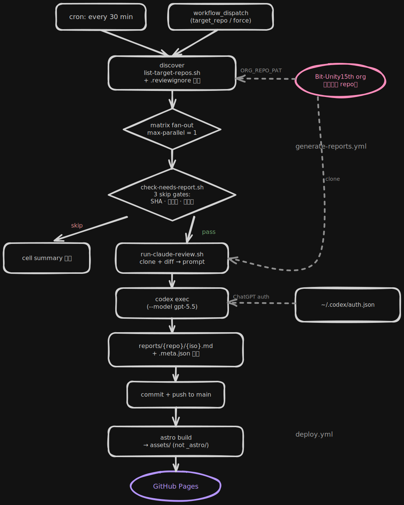

# Bit-Unity15th Dashboard

- **Deployed site**: https://bit-unity15th-multiplaygameprojects.github.io/_dashboard/
- **프로젝트 룰**: 전반적인 정책·파일 배치·리포트 포맷 규약은 [CLAUDE.md](./CLAUDE.md) 참고.

---

## 1. 프로젝트 개요

`Bit-Unity15th-MultiplayGameProjects` organization 안의 프로젝트 repo들에
대해 **Codex 기반 코드리뷰·진행도 리포트**를 GitHub Actions cron 으로 자동 생성하고,
생성된 리포트를 Astro 정적 사이트로 빌드하여 GitHub Pages 대시보드로 노출하는
중앙 오케스트레이터 repo. 프로젝트 repo에는 워크플로우·스크립트·커밋을 일절 추가하지
않고 오직 이 repo 한 곳에서 전체 파이프라인을 돌린다.

---

## 2. 동작 방식

전체 파이프라인은 **trigger → generate → deploy** 3단계.



> 원본은 `docs/pipeline.excalidraw`. 수정하려면 [excalidraw.com](https://excalidraw.com) 에
> 드래그해서 편집 후 SVG export("Embed scene" 체크) 로 `docs/pipeline.svg` 를 덮어쓴다.

핵심 흐름:

1. **discover** — `list-target-repos.sh` 로 org 안 프로젝트 repo 목록을 뽑는다.
   archived repo, `_` prefix repo, `.reviewignore` 에 나열된 repo 는 제외.
2. **review (repo 당 cell)** — `check-needs-report.sh` 의 3단계 skip 게이트
   (SHA 변화 / 쿨다운 / 커밋수) 를 통과한 repo 만 clone·diff 추출 후 Codex CLI 를
   호출한다. 결과는 `reports/<repo>/<iso>.md` 로 커밋·푸시. (`.meta.json` 이 없는
   first report 는 쿨다운·커밋수 게이트를 건너뛰고 바로 생성한다.)
3. **deploy** — `reports/` 변경을 감지한 `deploy.yml` 이 Astro 로 정적 빌드하여
   GitHub Pages 에 업로드한다.

### 2.1 리포트 스키마

각 리포트는 YAML frontmatter + 마크다운 본문. 주요 필드:

- **정량 지표** — `progress_estimate` (0-100), `doc_scores.{design,technical,spec}`
  (0-10), `commit_count`, `risk_level` ∈ {low, medium, high}
- **작업 항목 (객체 배열)** — `todos`, `backlogs`, `resolved_from_backlog`.
  각 항목은 `{ title, priority?, files?, details? }` 객체.
  - `priority` — `critical` (P0) / `high` (P1) / `medium` (P2) / `low` (P3).
    `todos` · `backlogs` 에 **필수**, `resolved_from_backlog` 에 **금지**.
    `todos` 는 priority 내림차순으로 정렬해서 출력.
  - `files` — repo 루트 기준 상대경로 배열 (1-4개). UI에서 GitHub 링크로 렌더.
  - `details` — 1줄 60-80자 보강 설명 (max 120). `title` 이 자명하면 생략.
- **호환성** — 스키마는 옛 `string[]` 항목도 파싱 (`src/lib/reports.ts`
  `normalizeItem` 에서 흡수). 신규 리포트만 객체 형식으로 생성.

전체 스펙은 [CLAUDE.md § 리포트 포맷](./CLAUDE.md) 과 `scripts/review-prompt.md`,
Zod 스키마는 `src/content/config.ts` 참조.

### 2.2 대시보드 UI

배포된 사이트는 세 레벨의 화면을 제공한다.

- **홈** — 5칸 stat strip(프로젝트 수 / 평균 진행도 / risk 분포 등) +
  risk 필터 탭 + grid/table 뷰 토글. 각 `ProjectCard` 는 progress
  sparkline, risk strip, 최상위 priority 에 해당하는 `PriorityBadge` 를
  함께 표시.
- **프로젝트 상세** (`/{repo}`) — 3 MetricCard(진행도 / 문서화 평균 /
  risk), 진행도 StepChart, 문서화(design·technical·spec) MultiLineChart,
  4 SmallMultiple(커밋수 / backlog 수 / 해결된 backlog / risk 추이).
  Backlog 리스트에는 `age` 배지 (몇 번째 리포트째 미해결인지) + priority
  배지가 함께 붙고, 전체 이력은 `BacklogHistoryDialog` 에서
  carry-over / resolved 를 한 번에 훑어볼 수 있다.
- **개별 리포트** (`/{repo}/{date}`) — 통합 `ProgressPanel` (큰 N/100 +
  progress bar + 3 doc-score bar), 본문 6 섹션, 전체 리포트 타임라인.
  todo/backlog 항목은 `PriorityBadge` + 파일 링크로 인라인 표기되며
  `details` 가 있는 항목은 `ItemDetailDialog` 로 펼쳐 전체 설명을 확인.

우상단 팔레트 아이콘을 누르면 `Tweaks` 플로팅 패널이 열려 light/dark
테마와 accent 색(indigo / emerald / amber / rose / violet / slate) 을
실시간 전환한다. 설정은 `localStorage` 에 저장되며 FOUC 방지용 boot
스크립트가 렌더 전에 클래스를 적용한다. 토큰은 OKLCH 기반.

---

## 3. 초기 세팅

> 이 repo 를 새로 포크하거나 org 안에 옮겨서 처음 동작시킬 때 한 번만 하면 된다.
> 아래 3단계를 순서대로 따라가면 된다.

### 3.1 Codex self-hosted runner 준비

review job 은 ChatGPT 구독 인증을 쓰는 Codex CLI 로 실행되므로 self-hosted runner 가 필요하다.
GitHub-hosted runner 에 API key 를 넣는 방식은 이 프로젝트의 기본 운영 방식이 아니다.

1. self-hosted runner 에 Codex CLI 설치:
   ```bash
   npm i -g @openai/codex@latest
   ```
2. browser 로그인이 가능한 신뢰된 머신에서 file-backed credential 을 켠 뒤 로그인:
   ```toml
   # ~/.codex/config.toml
   cli_auth_credentials_store = "file"
   forced_login_method = "chatgpt"
   ```
   ```bash
   codex login
   ```
3. 생성된 `~/.codex/auth.json` 이 ChatGPT auth 인지 확인:
   ```bash
   jq '{auth_mode, has_refresh_token: ((.tokens.refresh_token // "") != "")}' ~/.codex/auth.json
   ```
   `auth_mode` 는 `"chatgpt"`, `has_refresh_token` 은 `true` 여야 한다.
4. self-hosted runner 의 `$HOME/.codex/auth.json` 으로 배치하고 권한을 제한:
   ```bash
   chmod 700 ~/.codex
   chmod 600 ~/.codex/auth.json
   ```
5. runner 에 `codex` label 을 붙인다. workflow 의 review job 은 `runs-on: [self-hosted, codex]` 를 사용한다.

`auth.json` 은 access/refresh token 을 포함하므로 repo, issue, log, artifact 에 절대 저장하지 않는다.
workflow 는 기존 파일을 매번 덮어쓰지 않고, Codex 가 refresh 한 파일을 runner 디스크에 유지한다.

### 3.2 Secrets 등록

**Settings → Secrets and variables → Actions → New repository secret** 에서
아래 PAT 를 등록한다. Codex 인증은 self-hosted runner 의 `auth.json` 으로 처리한다.

#### 3.2.1 `ORG_REPO_PAT_BIT_UNITY_15TH`

org 내 프로젝트 private repo 를 읽기 위한 fine-grained PAT (read-only).
기본 `GITHUB_TOKEN` 으로는 org 의 다른 repo 에 접근할 수 없어 별도 PAT 이 필요하다.
`reports/` 커밋 푸시는 이 repo 의 `GITHUB_TOKEN` 이 처리하므로, PAT 자체는 쓰기 권한이 필요 없다.

1. GitHub → 개인 계정 **Settings → Developer settings → Personal access tokens
   → Fine-grained tokens → Generate new token**.
2. 주요 필드:
   - **Resource owner**: `Bit-Unity15th-MultiplayGameProjects`
     (권한이 없으면 org admin 에게 approve 요청 필요)
   - **Repository access**: *All repositories* (또는 프로젝트 repo 전부 + 이 repo)
   - **Repository permissions**:
     - **Contents**: **Read-only** (프로젝트 repo clone + `gh api` 호출 용)
     - **Metadata**: Read (자동 부여)
     - 그 외 모든 권한: **No access**
   - **Expiration**: org 정책에 따라 (최대 1년). 만료 전 알림 달력 등록 권장.
3. 발급된 토큰을 repo Secret `ORG_REPO_PAT_BIT_UNITY_15TH` 으로 등록.

> org 정책이 PAT approval 방식이면, org admin 이 approve 해야 토큰이 실제로 org
> repo 에 접근할 수 있다. 생성 직후 403 이 나면 이 상태를 의심.

### 3.3 GitHub Pages 활성화

기본값인 "Deploy from a branch" 로는 Actions 빌드 결과가 반영되지 않는다.

1. 이 repo → **Settings** → 좌측 **Pages**
2. **Build and deployment** → **Source** 드롭다운을 **GitHub Actions** 로 변경
3. 저장 (클릭 즉시 반영)

> 참고: repo 이름이 `_` 로 시작해 Pages 경로에 underscore 가 포함된다.
> `public/.nojekyll` 로 Jekyll 처리를 끄고 `build.assets: "assets"` 로 Astro 기본
> `_astro/` 디렉토리를 회피한다. 배포 후에도 404 가 나면 [CLAUDE.md § Known Issues](./CLAUDE.md#known-issues) 의 2차 대안 참고.

### 3.4 첫 빌드 트리거

Secrets 등록과 Pages source 전환이 끝났으면:

1. **Actions** 탭 → 좌측 **Deploy to Pages** → **Run workflow** (main, 수동).
   1~2분 뒤 `deploy` 잡의 Environment **github-pages** 링크에서 빈 대시보드 확인.
2. 이어서 **Actions** 탭 → **generate-reports** → **Run workflow** 로 첫 리포트
   생성을 유발한다. `target_repo` 입력을 비워두면 전체 대상 repo 를 훑고,
   적당한 프로젝트 하나를 지정해 시작하는 편을 권장 (첫 실행에서 문제를 빠르게 관찰 가능).
3. 성공한 cell 이 생기면 `reports/<repo>/` 가 커밋되고, 이 커밋이 main 으로
   push 되면서 `deploy.yml` 이 자동으로 다시 돈다 → 대시보드에 리포트가 뜬다.

이후부터는 cron 이 30 분마다 돌며 게이트를 통과한 repo 만 리뷰를 돌린다. 수동
개입은 불필요.

---

## 4. 운영 가이드

### 4.1 리포트 생성 주기 조정 (환경변수)

`.github/workflows/generate-reports.yml` 의 두 블록을 수정한다.

**cron 자체** (전체 체크 주기):

```yaml
on:
  schedule:
    - cron: "*/30 * * * *"   # 기본: 30분마다
```

**게이트 파라미터**:

```yaml
env:
  ORG: Bit-Unity15th-MultiplayGameProjects
  MIN_INTERVAL_HOURS: "6"   # 같은 repo 재리뷰 최소 간격
  MIN_COMMITS: "2"          # 이 값 미만 커밋이면 skip
```

- `MIN_INTERVAL_HOURS` 를 늘리면 리포트 간격이 벌어져 Codex 호출 수가 준다.
- `MIN_COMMITS` 를 늘리면 잔잔한 작업(1커밋짜리 오타 수정 등)에 리포트가 안
  낭비된다.
- cron 자체를 `0 */2 * * *` 같이 늘리면 discover/gate 실행 빈도도 줄어
  Actions 사용량까지 절감된다. 단 프로젝트 push 에 대한 반응성은 낮아진다.

수정 후 main 에 push 하면 다음 cron 틱부터 적용.

### 4.2 특정 repo 만 수동 리포트 생성 (`workflow_dispatch`)

1. Actions → **generate-reports** → **Run workflow**.
2. 입력값:

   | 입력 | 의미 | 비고 |
   |---|---|---|
   | `target_repo` | 특정 repo 이름 하나 (예: `Exit-or-Die_EEN`) | 비우면 전체 |
   | `force` | 쿨다운/커밋수 게이트 무시 | SHA 가 `last_sha` 와 같으면 여전히 skip (토큰 낭비 방지) |

3. **Run workflow** 클릭.

디버깅 시나리오별 권장 조합:

- 특정 프로젝트의 리뷰만 즉시 재생성: `target_repo` 만 채우고 `force=false` 로 시작.
  게이트가 막으면 `force=true` 로 재시도.
- 프롬프트 변경 후 한 프로젝트에만 검증: `target_repo=<repo>`, `force=true`.
  (게이트 우회하되 불필요한 호출은 SHA 비교가 막아줌.)

### 4.3 특정 repo 를 리뷰 대상에서 제외 (`.reviewignore`)

repo root 에 `.reviewignore` 파일을 만들고 제외할 repo 이름을 한 줄에 하나씩
적는다. `#` 뒤는 주석으로 처리되며 (줄 중간도 OK) 빈 줄은 무시된다.

```
# .reviewignore 예시

# 최종 제출 완료
archived-team-alpha

# 내부 통합 — beta 와 gamma 는 gamma 로 합쳤다
beta   # 2026-03 통합

# 미사용 template
project-template
```

- `list-target-repos.sh` 가 discover 단계에서 이 파일을 읽어 배열에서 빼낸다.
- 파일이 없으면 아무 필터링도 안 한다 (기존 동작 그대로).
- 커밋 후 main push → 다음 cron 실행부터 반영.
- 다시 리뷰 대상에 넣으려면 해당 줄을 지우고 push 하면 된다.

---

## 5. 트러블슈팅

### 5.1 Codex 구독 한도 초과 또는 auth 만료 시

**증상**: review cell 로그에 Codex CLI 가 401/429/rate limit 메시지로 종료,
cell 이 failed. Actions summary 에 `status=failed`, `out_file` 없음.

**완화 (순서대로 시도)**:

1. `generate-reports.yml` 은 기본 `max-parallel: 1` 이다. 단일 `auth.json` 을 여러 job 이
   동시에 쓰지 않도록 이 값을 올리지 않는다.
2. `MIN_INTERVAL_HOURS` 상향 (6 → 12), `MIN_COMMITS` 상향 (2 → 5) 으로 실제
   호출 빈도 감소.
3. 401 이 지속되면 trusted machine 에서 `codex login` 을 다시 수행하고 self-hosted
   runner 의 `~/.codex/auth.json` 을 재시드한다.

**빠른 복구**: rate limit 으로 실패한 cell 은 `.meta.json` 이 갱신되지 않으므로
다음 cron 틱에서 같은 범위로 자연 재시도된다 (별도 조치 불필요).

### 5.2 PAT 만료 시

**증상**:

- discover 잡이 `gh repo list` 단계에서 401/403 으로 실패, 모든 cell 이 skip.
- 또는 gate 단계의 `gh api repos/ORG/REPO/commits/...` 가 실패하면서 cell 이
  `exit 2` 로 종료.

**대응**:

1. GitHub → Developer settings → Personal access tokens 에서
   `ORG_REPO_PAT_BIT_UNITY_15TH` 토큰을 **Regenerate**.
   - 같은 권한 범위 유지 (Contents: **Read-only** + Metadata: Read, org 선택).
   - org 정책상 approval 이 걸린다면 org admin 에게 재승인 요청.
2. 이 repo → Settings → Secrets → `ORG_REPO_PAT_BIT_UNITY_15TH` → **Update** 로 새 토큰 주입.
3. Actions → **generate-reports** → Run workflow 로 즉시 검증.

**예방**: PAT 만료일 1~2주 전에 달력 알림 등록. GitHub 공식 만료 이메일은
스팸함에 잘 들어간다.

### 5.3 리포트 포맷이 깨질 때 (프롬프트 튜닝 포인트)

**증상**:

- `deploy.yml` 의 `astro build` 가 zod schema 에러로 실패. 보통 `commit_range`
  형식 오류, `risk_level` 이 enum 밖, `date` 가 offset 없이 date-only,
  todo/backlog 항목의 `priority` 누락 / 미허용 값, `details` 120자 초과,
  `resolved_from_backlog` 에 priority/details 가 섞여 들어옴 등.
- 또는 빌드는 성공해도 대시보드 카드가 이상하게 찍힘 (summary 가 과도하게 길거나,
  tags 에 이모지·문장 등).

**재현·디버깅**:

```bash
# dry-run — Codex 호출 없이 치환된 최종 프롬프트 확인
./scripts/test-prompt.sh Exit-or-Die_EEN

# 실제 Codex 호출 + 출력 frontmatter 스키마 자동 검증
./scripts/test-prompt.sh Exit-or-Die_EEN --run

# 범위 오버라이드
./scripts/test-prompt.sh Exit-or-Die_EEN --run --range HEAD~10..HEAD
```

`--run` 모드는 출력 끝에 `[validate-report] OK` 또는
`[validate-report] SCHEMA ISSUES:` 를 stderr 에 찍어준다. 깨진 항목이 뭔지
여기서 확인. (`--fixable` 한 포맷 미스는 `[validate-report] AUTO-FIXED:` 로
자동 보정되므로 로그에서 함께 확인할 것.)

**튜닝 포인트** (`scripts/review-prompt.md`):

| 위치 | 언제 만지나 |
|---|---|
| 상단 HTML 주석 블록 | 변수 목록 갱신 시 (Codex 에게는 안 보임) |
| `# 평가 기준` | 리뷰 깊이/범위 변경 (예: 새 축 추가) |
| `# risk_level 판정 기준` | 판정이 일관되게 너무 낮거나 높게 나올 때 |
| ``# `progress_estimate` / `todos` / `backlogs` 산출`` | priority 분포가 기울 때 (critical 남용 등), details 룰 변경 시 |
| `# 출력 포맷 > Frontmatter 필드` | 스키마 변경 시 — **반드시** `src/content/config.ts` 와 동시에 수정 |
| `# 금지사항` | 반복적으로 나오는 포맷 위반을 명시적으로 금지 |

> `src/content/config.ts` 의 zod 스키마가 최종 규격이다. 프롬프트의 "출력 포맷"
> 섹션은 이 스키마를 따라가기만 하면 된다. 둘이 어긋나면 빌드가 깨진다.

튜닝 직후엔 최소 3~5 개 repo 에 대해 `test-prompt.sh --run` 을 돌려 validator 가
모두 OK 인지 확인한 뒤 main 에 머지.

### 5.4 기타 자주 보는 이슈

- **Pages URL 에서 404**: Settings → Pages → Source 가 "GitHub Actions" 인지
  먼저 확인.
- **asset 404 (CSS 미로드)**: `dist/.nojekyll` 존재 여부, `astro.config.mjs` 의
  `build.assets: "assets"` 생존 여부 확인.
- **리포트는 커밋됐는데 배포가 안 됨**: `deploy.yml` 은 `reports/` 커밋에 딸려
  오는 `.meta.json` 이 `paths-ignore: "**.md"` 를 뚫어주는 덕분에 push trigger 로
  걸린다. `.meta.json` 이 안 바뀐 커밋이면 배포가 스킵될 수 있으니 Actions 탭에서
  **Deploy to Pages → Run workflow** 로 수동 재빌드.

---

## 6. 호출량 예상

이 프로젝트는 self-hosted runner 에 유지된 ChatGPT-managed Codex auth 로
`codex exec --model gpt-5.5` 를 호출한다. 즉 기본 운영에서는 `OPENAI_API_KEY` 를 쓰지 않고,
Codex 구독 한도에 카운팅된다.

### 6.1 일일 호출 수 계산식

```
daily_codex_calls ≈ N × R
```

- `N` — 리뷰 대상 repo 수 (archived, `_`-prefix, `.reviewignore` 제외 후의 실제 cell 수).
- `R` — 한 repo 가 하루에 생성하는 리포트 수.
  - 상한: `24 / MIN_INTERVAL_HOURS` (기본 6 → 최대 4 리포트/일/repo).
  - 실측: 활발한 프로젝트 2~3, 잔잔한 프로젝트 0~1 정도. 평균 1~2 로 잡으면 현실적.

### 6.2 운영상 주의

Codex 구독 한도와 모델 제공 범위는 계정/워크스페이스 정책에 따라 달라질 수 있다.
CI 자동화의 일반 권장은 API key 이지만, 이 repo 는 trusted self-hosted runner 에서
ChatGPT auth 를 유지하는 고급 패턴을 선택한다. `auth.json` 은 한 runner/직렬 stream 에서만
사용하고, workflow 는 API key 환경변수를 명시적으로 unset 한다.

### 6.3 예시 시나리오

| 규모 | N | 평균 R/day | 일일 Codex 호출 | 운영 메모 |
|---|---:|---:|---:|---|
| 소규모 | 8 | 2 | 16 | 여유 |
| 기본 (현재 예상) | 15 | 2 | 30 | 기본 게이트 유지 |
| 대규모 | 30 | 3 | 90 | interval/ignore 조정 권장 |
| 병행 운영 | 60 | 3 | 180 | 별도 runner/auth stream 분리 검토 |

### 6.4 비용·쿼터 절감 레버

- `MIN_INTERVAL_HOURS` 상향 → 같은 repo 재리뷰 빈도 감소 (호출 수 직접 감소).
- `MAX_DIFF_BYTES` / `MAX_DIFF_LINES` 하향 (`run-claude-review.sh` 기본 100KB
  / 3000 lines) → 호출당 토큰량 감소 (window 쿼터 소모 감소).
- `.reviewignore` 로 비활성 프로젝트 상시 제외.
- cron 주기를 `*/30` → `0 */2` 등으로 늘리면 Actions 자체 무료 분도 절약.

---

## 로컬 개발

```bash
npm install
npm run dev       # http://localhost:4321/_dashboard/
npm run build     # → dist/
npm run preview   # 빌드 결과 미리보기
```

Node 20+ 필요.

프롬프트만 로컬 검증하려면:

```bash
./scripts/test-prompt.sh <repo>            # dry-run
./scripts/test-prompt.sh <repo> --run      # 실제 Codex 호출 + 스키마 검증
```

## 디렉토리

- `src/` — Astro 프론트엔드 (`lib/reports.ts` 에 todo/backlog 정규화 + priority 유틸)
- `reports/{project}/*.md` — Codex 가 생성한 리뷰 리포트 (git 에 커밋됨)
- `reports/{project}/.meta.json` — 각 프로젝트의 `last_sha`, `last_report_at`
- `scripts/` — cron orchestration
- `.github/workflows/` — CI/CD
- `.reviewignore` — (선택) 리뷰 제외 repo 목록

전체 구조·정책은 [CLAUDE.md](./CLAUDE.md) 참고.
