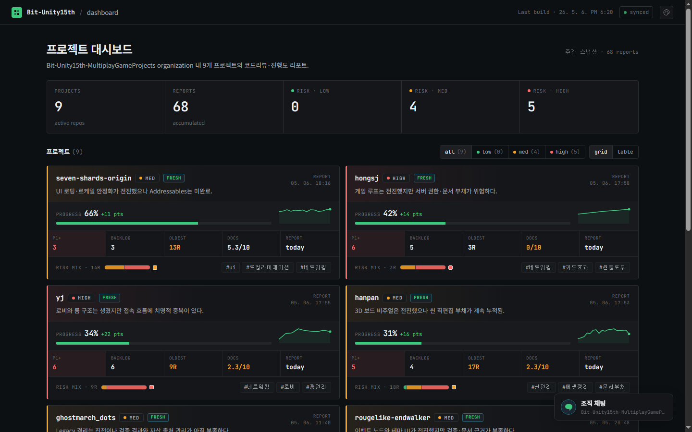
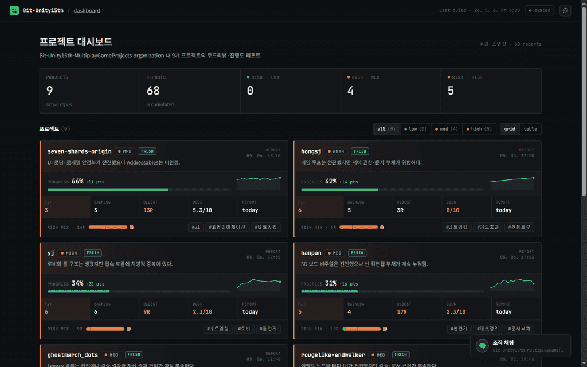
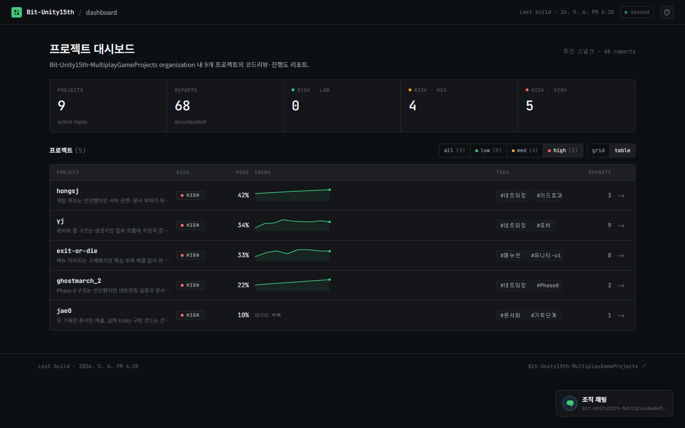
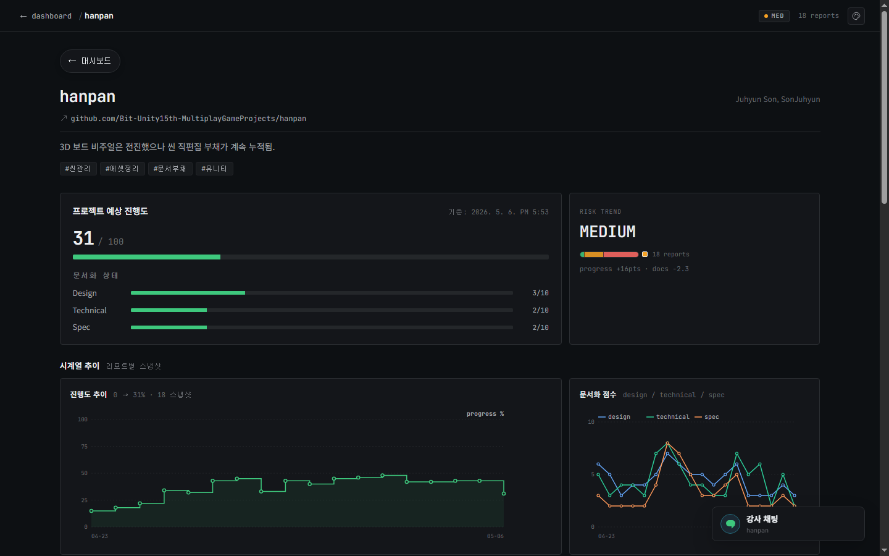
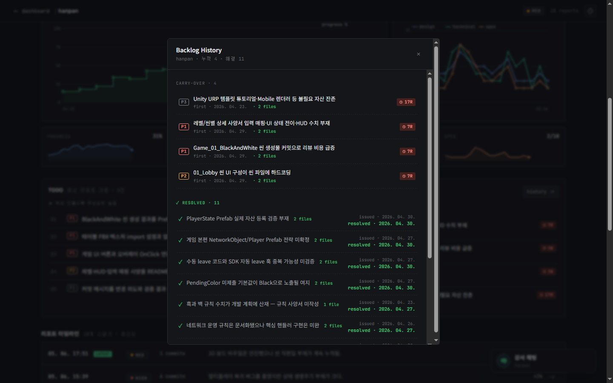
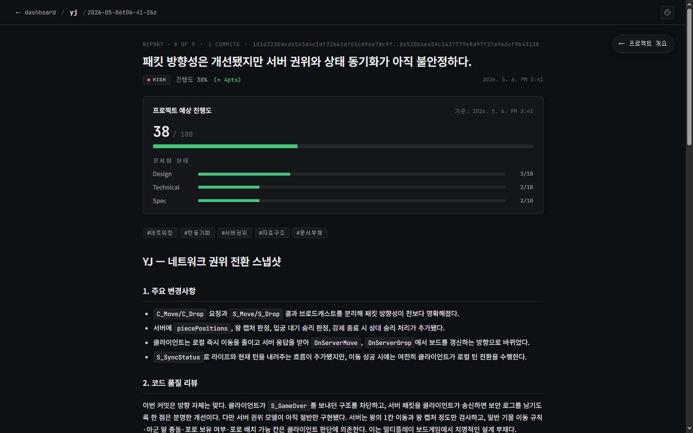
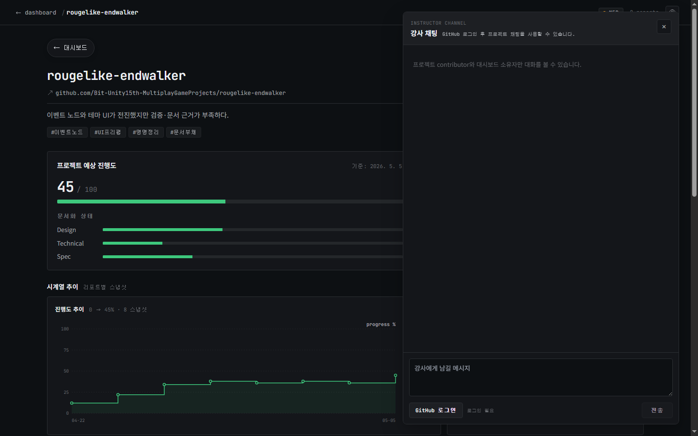

# Bit-Unity15th Project Dashboard

<p align="center">
  
</p>

<p align="center">
  <a href="https://bit-unity15th-multiplaygameprojects.github.io/_dashboard/"><strong>대시보드 바로가기</strong></a>
  ·
  <a href="docs/pipeline.svg"><strong>자동화 흐름</strong></a>
  ·
  <a href="CLAUDE.md"><strong>운영 규칙</strong></a>
</p>

이 대시보드는 Bit-Unity 15기 멀티플레이 게임 프로젝트들의 자동 코드리뷰와 진행도 리포트를 모아 보는 수업용 페이지입니다. 각 프로젝트 repo의 새 커밋을 기준으로 Codex가 한국어 리뷰 리포트를 작성하고, 진행도, 위험도, todo, backlog, 문서화 상태를 정리합니다.

학생은 본인 팀 카드와 최신 리포트를 확인해 다음 커밋에서 무엇을 먼저 고칠지 판단하면 됩니다. 프로젝트 repo에는 대시보드용 workflow나 설정 파일을 추가하지 않고, 모든 자동화 상태는 이 `_dashboard` repo 안에서 관리합니다.

## 무엇을 보면 되나

| 확인할 것 | 대시보드에서 보는 곳 |
|---|---|
| 우리 팀의 현재 상태 | 프로젝트 카드의 진행도, risk, 최신 리포트 시각 |
| 다음에 먼저 고칠 것 | 최신 리포트의 `todos`, priority badge, 관련 파일 |
| 계속 밀리는 문제 | 프로젝트 상세 화면의 Backlog History |
| 문서화 부족 여부 | design, technical, spec 문서 점수 |
| 최근 커밋의 리뷰 내용 | 개별 리포트 상세 화면 |
| 강사 피드백 | 프로젝트별 채팅 패널 |

## 화면 미리보기

아래 이미지는 모두 실제 배포 중인 [대시보드](https://bit-unity15th-multiplaygameprojects.github.io/_dashboard/)를 다크 테마로 캡처한 화면입니다.

<p align="center">
  
</p>

## 1. 전체 프로젝트 현황


첫 화면에서는 수업 전체 프로젝트의 진행 상황을 한 번에 볼 수 있습니다. 프로젝트 수, 누적 리포트 수, risk 분포가 상단에 표시되고, 각 프로젝트 카드에는 최신 리포트 기준 진행도, 위험도, backlog 수, 문서 점수가 정리됩니다.

본인 팀 카드에서 최신 리포트가 언제 생성됐는지, risk가 올라갔는지, todo나 backlog가 많이 쌓였는지 먼저 확인하면 됩니다.

## 2. Risk 테이블



테이블 화면은 여러 프로젝트를 빠르게 비교할 때 사용합니다. `high`, `medium`, `low` risk 필터로 상태가 비슷한 프로젝트를 모아 볼 수 있고, 진행도와 backlog 수를 함께 확인할 수 있습니다.

팀별로 어떤 항목이 위험 신호로 잡혔는지 비교하면, 단순히 진행률만 보는 것보다 현재 병목을 더 빨리 찾을 수 있습니다.

## 3. 프로젝트 상세 화면



`HANPAN` 프로젝트 상세 화면입니다. 한 프로젝트의 진행도 변화, risk trend, 문서 점수, commit 수, backlog 변화를 시간순으로 확인할 수 있습니다.

최신 리포트 하나만 보는 대신 프로젝트의 흐름을 함께 보면, 최근에 좋아진 부분과 계속 반복되는 문제가 더 분명하게 보입니다.

## 4. Backlog History



`HANPAN` 프로젝트의 Backlog History 화면입니다. 아직 해결되지 않은 항목과 이전 리포트에서 해결된 항목을 따로 볼 수 있고, 각 backlog에는 priority, 처음 등장한 날짜, 관련 파일, 이월 횟수가 표시됩니다.

반복해서 등장하는 backlog는 다음 작업에서 우선순위를 높게 잡는 것이 좋습니다. 해결된 항목은 팀이 실제로 어떤 문제를 정리했는지 확인하는 기록으로 남습니다.

## 5. 최신 리포트 상세



`YJ` 프로젝트의 최신 리포트 상세 화면입니다. 상단에는 commit range, risk, 진행도, 문서 점수가 표시되고, 본문에는 주요 변경사항, 코드 품질 리뷰, 진행도 평가, 다음 권장사항, 문서화 상태, backlog가 정리됩니다.

리포트를 읽을 때는 `다음 권장사항`과 `Backlog`를 먼저 확인하면 좋습니다. 관련 파일이 함께 표시되는 항목은 해당 파일을 열어 바로 수정 방향을 잡을 수 있습니다.

## 6. 프로젝트 채팅



`rougelike-endwalker` 프로젝트의 채팅 패널입니다. 프로젝트별 채팅은 GitHub 로그인과 프로젝트 권한을 확인한 뒤 접근할 수 있습니다. 권한이 있는 세션에서는 해당 프로젝트에 대한 강사 피드백과 팀 응답을 같은 화면에서 확인할 수 있습니다.

이 캡처는 자동 캡처 환경에서 GitHub OAuth 세션 없이 접근했을 때의 실제 화면입니다. 실제 피드백 내역은 로그인된 브라우저에서 프로젝트 권한이 확인된 경우에만 표시됩니다.

## 자동화 흐름


```text
GitHub organization
  -> 리뷰 대상 repo 탐색
  -> 교육용 repo, archived repo, 제외 repo skip
  -> 마지막 리포트 이후 새 커밋 확인
  -> 호출 간격과 커밋 수 gate 확인
  -> 대상 repo read-only clone
  -> Codex 리뷰 프롬프트 생성
  -> Markdown 리포트 검증
  -> reports/{repo}/... 저장
  -> Astro 대시보드 빌드
  -> GitHub Pages 배포
```

주요 원칙은 다음과 같습니다.

- `_` prefix로 시작하는 repo는 교육용 repo로 보고 리뷰 대상에서 제외합니다.
- archived repo와 `.reviewignore`에 적힌 repo도 제외합니다.
- 마지막 리포트 이후 새 커밋이 없으면 Codex를 호출하지 않습니다.
- 기본 설정에서는 마지막 리포트 이후 6시간이 지나고, 새 커밋이 2개 이상일 때만 새 리포트를 생성합니다.
- 프로젝트 repo는 read-only로만 다루며, workflow나 설정 파일을 추가하지 않습니다.
- 생성된 리포트와 상태 정보는 `reports/{repo}/` 아래에 저장됩니다.

## 리포트 형식

각 리포트는 YAML frontmatter와 Markdown 본문으로 구성됩니다.

```yaml
project: "TeamProject"
date: "2026-05-06T18:16:00+09:00"
commit_range: "abc123..def456"
commit_count: 4
risk_level: "medium"
tags: ["네트워크", "UI", "문서화"]
summary: "로비 흐름은 정리됐지만 접속 실패 처리가 부족함"
progress_estimate: 66
doc_scores:
  design: 6
  technical: 5
  spec: 5
todos:
  - title: "룸 접속 실패 케이스를 테스트로 고정"
    priority: "high"
    files: ["Assets/Scripts/Network/RoomController.cs"]
    details: "접속 실패 때 UI와 세션 상태가 갈라지는 경로를 먼저 막는다."
backlogs:
  - title: "Addressables 로딩 정책 문서화"
    priority: "medium"
resolved_from_backlog: []
```

본문에는 주요 변경사항, 코드 품질 리뷰, 진행도 평가, 다음 권장사항, 문서화 상태, Backlog가 포함됩니다. 최종 스키마는 [src/content/config.ts](./src/content/config.ts), 검증기는 [scripts/validate-report.py](./scripts/validate-report.py)에 있습니다.

## 로컬 확인

```bash
npm install
npm run dev       # http://localhost:4321/_dashboard/
npm run build
npm run preview
```

프롬프트만 로컬에서 확인하려면 다음 명령을 사용합니다.

```bash
./scripts/test-prompt.sh <repo>
./scripts/test-prompt.sh <repo> --run
```

`--run`은 실제 Codex 호출과 report validator를 실행합니다. 호출 비용과 구독 한도를 의식해 필요한 repo에만 사용하세요.

## 디렉토리 구조

```text
_dashboard/
├─ .github/workflows/      # 리포트 생성과 Pages 배포
├─ scripts/                # repo 탐색, gate, Codex prompt, 검증
├─ reports/{repo}/         # 생성된 리포트와 .meta.json
├─ src/                    # Astro 대시보드
├─ db/                     # 프로젝트 채팅용 Supabase schema
├─ docs/                   # 다이어그램과 README 이미지
└─ public/.nojekyll        # GitHub Pages underscore 경로 보호
```

현재 운영 중인 대시보드는 [Bit-Unity15th-MultiplayGameProjects](https://github.com/Bit-Unity15th-MultiplayGameProjects) organization의 프로젝트 리포트를 기준으로 생성됩니다.
